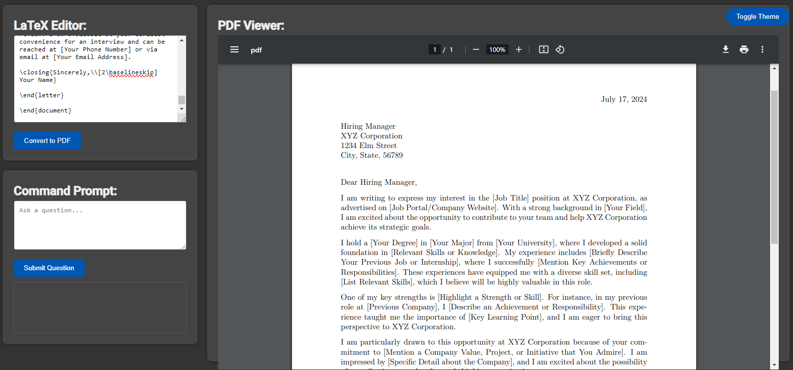

# ChatLaTeX

<div align="center">
  
</div>

## Overview
ChatLaTeX is a simplified text-based version of ChatLaTeX, designed to assist you in editing your CV and resume with the help of ChatGPT. This tool allows ChatGPT to continuously read and interpret your LaTeX code in the LaTeX editor, enabling you to make dynamic and intelligent requests for generating CVs, cover letters, and other professional documents.

## Features
- **Real-time LaTeX Editing**: ChatGPT reads your LaTeX code in real-time, allowing for instant feedback and modifications.
- **Generate Documents**: Easily generate CVs or cover letters based on specific prompts or requirements.
- **Dynamic Responses**: Ask ChatGPT to create documents based on job requirements, such as "please write a cover letter based on the requirements of Company X, their requirements are 1, 2, 3,...".
- **Flexibility**: If a full LaTeX code is not asked in the prompt, ChatGPT may respond with text that you can incorporate into your document.

## Usage Instructions
1. **Setup MiKTeX**:
   - Install MiKTeX from [MiKTeX Official Website](https://miktex.org/download).
   - During installation, ensure to select the option to install the necessary LaTeX compilers, including `xelatex`.

2. **Setup xelatex_path in `config.yaml`**:
   - After installing MiKTeX, locate the `xelatex` executable path (`xelatex.exe`). This is typically found in a path similar to:
     ```
     C:\Users\YourUsername\AppData\Local\Programs\MiKTeX\miktex\bin\x64\xelatex.exe
     ```
   - Update the `config.yaml` file with the correct path:
     ```yaml
     api_key: "Your ChatGPT API Key"
     engine: "gpt-3.5-turbo"
     proxy: null
     max_tokens: 4000
     temperature: 0.5
     top_p: 1.0
     timeout: 100
     presence_penalty: 0.0
     frequency_penalty: 0.0
     truncate_limit: 3000
     reply_count: 1
     system_prompt: "You are ChatGPT, a large language model trained by OpenAI. Respond conversationally."
     xelatex_path: "C:\\Users\\YourUsername\\AppData\\Local\\Programs\\MiKTeX\\miktex\\bin\\x64\\xelatex.exe"
     ```

3. **Running the Application**:
   - Clone or download the ChatCV repository.
   - Install Python dependencies listed in `requirements.txt` using:
     ```
     pip install -r requirements.txt
     ```
   - Start the Flask application using:
     ```
     python app.py
     ```
   - Open your browser and navigate to `http://localhost:5000` to access the LaTeX editor.

4. **Editing LaTeX Documents**:
   - Enter your LaTeX code in the editor provided on the webpage.
   - Click on the "Convert PDF" button to generate and view the PDF output of your LaTeX code.

5. **Asking ChatGPT**:
   - In the "Command Prompt" section, enter your request for ChatGPT. For example:
     ``` 
     Please generate a CV based on the cover letter.
     ```
   - Alternatively, you can ask:
     ``` 
     Please write a cover letter based on the requirements of Company X. Their requirements are the following: 1, 2, 3,...
     ```
   - Click the "Ask Question" button to get a response from ChatGPT.

6. **Integrating Responses**:
   - If ChatGPT provides text instead of LaTeX code, manually integrate the provided text into your LaTeX document.

## Tips
- Always provide as much detail as possible in your requests to ChatGPT for the best results.
- Ensure your LaTeX code has the correct structure to avoid compilation errors.
